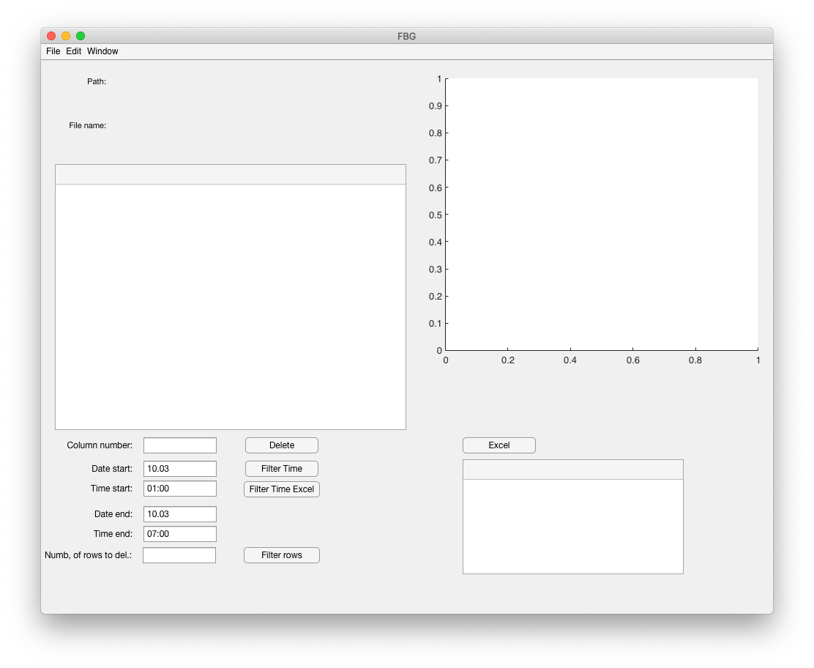
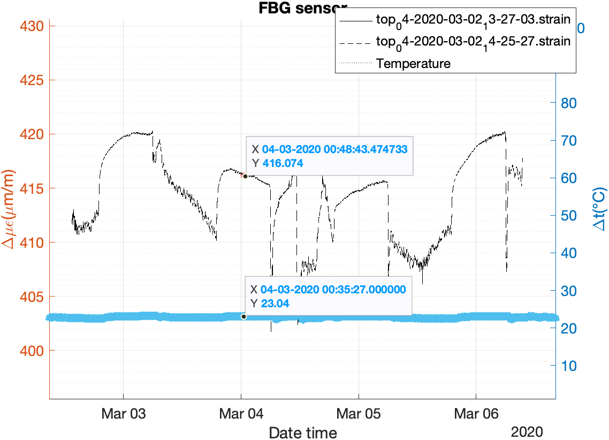
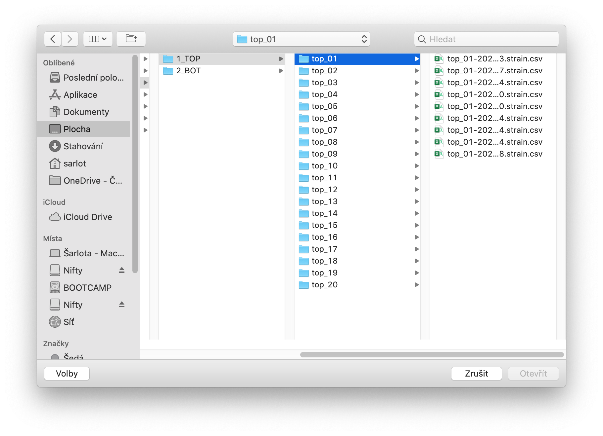

# Thesis

My diploma thesis dealt with geotechnical monitoring, where FBG sensors were used for the first time, to monitor deformations of gabion structures reinforced with tensile networks, which were used to ensure the stability of local roads due to slope movements in the vicinity.

## Why I needed to develop an application
The goal of developing this application was to facilitate the processing of measurement results, as Microsoft Excel cannot be used for such a large amount of data. Microsoft Excel can process 1 449 576 rows. I needed to work with 54 files for the lower sensors and another 54 files for the upper sensors. There were about 150 000 lines in one file. It is therefore clear that the use of Microsoft Excel would be time consuming, and for this reason an application has been created which can retrieve data from files selected by the user and further work with and analyze this data.

## Creating application
To create a user-friendly application, I chose the MATLAB programming environment, which is one of the basic computing tools in educational and research institutions around the world. The program contains a graphical user interface, also called GUI (Graphical User Interface), in which I chose the integrated editor *App Designer*. In the editor, you can build an application from pre-prepared graphic objects, and place them arbitrarily on the default desktop. After completing the application, you can use the compiler that is part of MATLAB to create a standalone application that can be made available to other users without the need to install MATLAB itself.

## Requirements for loaded files

The application is designed to be able to read data from a text file (* .csv). This data type is the most used file for electronic data output from measuring instruments. The values distinguish the decimal place by a decimal point and the individual columns are separated by a semicolon. It is also possible to load data from the Microsoft Excel spreadsheet editor (* .xls) and (* .xlsx).

The following image shows the application window at startup. 

Here is a sample graph created from selected data.

# Application description

The top drop-down menu offers the following items:

- File
    - Open...
    - Open multiple folders
    - Close
    - PrintPreview
- Edit
    - Generate Graph
    - Clear Table
    - Clear Graph
    - Average data by hour
    - Avarage temperature by hour
    - Same temperature

- Window
    - Maximize
    - Minimize

After opening *File* from the top menu bar, you can select *Open* and load individual files of data type (* .csv) or select *Open multiple folders* and select a specific folder that contains another subfolders containing specific data as seen below in the figure. It is necessary to select in this window which data type of file is to be selected. The *Excel* button can be used to select data files of the type (* .xls) or newer type (* .xlsx) via the same window. After selecting the files, the window will close and the data will be loaded into the appropriate table environment. The header and the values themselves are loaded separately. The header consists of a description of the individual columns. If the user closes the window without any selection while selecting data, an error message will pop up and show the text that *no file has been selected*.

After selecting from the top menu bar *File* and then *Close*, the application will ask if the user really wants to close the application. The application can also be closed using the preset buttons of the operating system, see the color menu of the wheels above the top menu bar. Another selection option is *PrintPreview*, which is used to open the print window, to be able to print the relevant graph.

When choosing *Edit* we have a larger offer here. The first option in the list is *Generate Graph*, which generates a graph from both tables, ie (*. Csv) and (* .xls) or (* .xlsx) files.

*Clear Table* and *Clear Graph* clear all data from both the table and the graph.

*Avarage data by hour* allows the user to enter the time from - to, in which the measured values ​​are averaged on a given day and time interval, and then write to (* .xls) and (* .txt) the file.

*Avarage temperature by hour* allows the user to enter the time from - to, in which the measured temperature values ​​on a given day and time interval are averaged, and write to (* .xls) and (* .txt) file .

*Same temperature* allows the user to enter a time range from - to select a stable temperature for as many consecutive days as possible. The program lists the number of consecutive days with the same temperature from the total number of days. Finally, it writes to (* .xls) and (* .txt) the days with the appropriate temperature and measured value on the individual sensors.

After selecting *Window* from the top menu bar, the application window can be enlarged to full screen or the application window can be minimized to the bar. The application can be maximized or minimized again using the preset buttons of the operating system.

There are also single-state buttons in the application. I have already described the *Excel* button, see above.The larger table is for data read via *File* and then *Open* or *Open multiple folders*, which read the data type (* .csv). The second table is intended for reading data via the *Excel* button, which loads the data type (* .xls) and (* .xlsx).

The other buttons in the application are intended for editing and clarifying tables. In the first rewritable text box, the user enters the number of the column he wishes to delete. After pressing the *Delete* key, the given column is deleted from the main table.

The *Filter Time* button and the *Filter Time Excel* button are used to sort specific data in tables. The user fills in the start date, end date and in what time interval the data is filtered in the rewritable text field.

Since the data is stored every four seconds when measuring with the FBG sensor and in this case I do not need so many values, the *Filter rows* button will be used to delete the redundant data.
